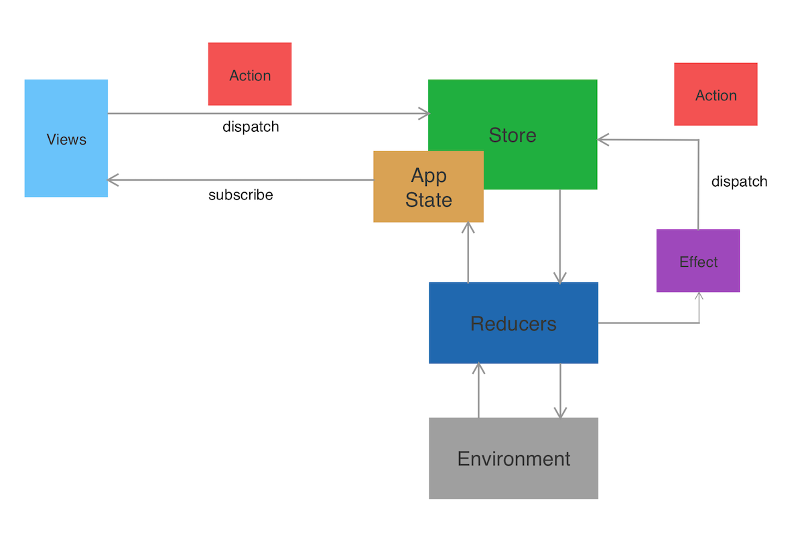

# Toggl's iOS app

# Architecture

## Sources

The app architecture is based on different sources, it has some of Redux and some of Elm. It's based on the work of [these guys](https://www.pointfree.co) and [this](https://github.com/ReactiveX/RxSwift), and also a little bit from [this](https://guide.elm-lang.org/architecture/).

It also takes from things learned in the past by using [similar](https://github.com/Odrakir/CachopoDemo) [approaches](https://github.com/toggl/watchos-app).

The approach we took to implement these ideas relies heavily in Rx concepts (speficically in RxSwift for this app)

## Parts

This is a high level overview of the different parts of the architecture. 



- **Views** This is anything that can subscribe to the store to be notified of state changes. Normally this happens only from views (UIViews or UIViewControllers), but other elements of the app could also react to state changes.
- **Action** Simple structs that describe an event, normally originated by the user, but also from other sources or in response to other actions (from Effects). The only way to change the state is through actions. Views dispatch actions to the store which handles them in the main thread as they come.
- **Store** The central hub of the application. Contains the whole state of the app, handles the dispatched actions passing them to the reducers and fires Effects. It also handles the app's dependencies (Environment)
- **App State** The single source of truth for the whole app. This will be almost empty when the application start and will be filled after every action. This won't contain any derived state (meaning any state that can be calculated from any other state). This won't be a copy of the DB, it doesn't have to necessarily contain everything in the DB all the time and also, it'll include other stuff not in the DB (like the current route or a flag indicating if the app is in the background, for example). Basically you have to ask yourself what do you need to store here so you can restart the app in the exact same place as it was before shutting it down (even if we are never going to need that)
- **Reducers** Reducers are pure functions that take the state and an action and produce a new state. Simple as that. In our case they also take the environment (just the part they need) and optionally result in an Effect that will asynchronously dispatch further actions. All business logic should reside in them.
- **Effects** As mentioned, Reducers optionally produce these after handling an action. They are just observables that can emit further actions. Those observables are subscribed to in the store and the emitted actions will be dispatched again. These are use as a way to handle asynchronous actions.
- **Environment** This will hold all the dependencies our reducers need, so basically everything in the infrastructure layer. Examples could be the DataBase, the API, a timer service, a location service... This is passed into the store on construction and the store takes care of injecting it into the reducers.

There's one global `Store` and one `AppState`. But we can *view* into the store to get sub-stores that only work on one part of the state. More on that later.

There's also one main `Reducer` but multiple sub-reducers that handle a limited set of actions and only a part of the state. Those reducers are then *pulled back* and *combined* into the main 
reducer.

## Store & State

The `Store` exposes an observable which emits the whole state of the app everytime there's a change and a method to dispatch actions that will modify that state.

In order for it to work it uses the app `Reducer` and the `Environment`. More on these two later.

The `State` is just a struct that contains ALL the state of the application. All properties are `var`, because we are going to mutate it, but don't worry, mutations only happen in reducers. It has an initializer with no parameters which creates the initial state of the app.

It also includes the local state of all the specific modules that need local state. More on this later.

The store is built like this:

```swift
let store: Store<AppState, AppAction> = Store(
    initialState: AppState(),
    reducer: appReducer,
    environment: appEnvironment
)
```

actions are dispatched like this:

```swift
store.dispatch(AppAction.start)
```

and views can subscribe directly to the state or through the select method which takes a closure to map part of the state, and also to not repeat events if the elements are `Equatable`

```swift
store.state
    .subscribe(onNext: { print("The whole state: \($0)") })
    .disposed(by: disposeBag)

// or

store.select({ $0.email })
    .drive(emailTextField.rx.text)
    .disposed(by: disposeBag)
```

The store can be "viewed into", which means that we'll treat a generic store as if it was a more specific one which deals with only part of the app state and a subset of the actions. More on STORE VIEWS.

## Actions

Actions are enums, which makes it easier to discover which actions are available and also add the certainty that we are handling all of them in reducers.

These enums are embeded into each other starting with the `AppAction`

```swift
public enum AppAction
{
    case start

    case onboarding(OnboardingAction)
    case timer(TimerAction)
}
```

So to dispatch an `OnboardingAction` to a store that takes `AppActions` we would do

```swift
store.dispatch(.onboading(.start))
```

But if the store is a view that takes `OnboardingActions` we'd do it like this:

```swift
store.dispatch(.start)
```

## Batching actions

Sometimes we might want to dispacth multiple actions one after another. It might not be efficient to emit state changes after each of of those actions, also it might cause problems with some animations, that's why there's the `batch` method on `Store`.

```swift
public func batch(_ actions: [Action])
```

It takes an array of actions and executes all of them before emiting the new state. It's worth noting that the state itself will update, so every action will get the updated state, but it won't be emitted outside of the store until all of them are done.

TODO: Something we should look into is what happens with the Effects resulting from those actions. Maybe it makes sense to always batch all actions emitted from an effect.

## Reducers & Effects

Reducers are functions with this shape:

```swift
(inout StateType, ActionType, Environment) -> Effect<ActionType>
```

The idea is they take the state and an action and modify the state depending on the action and its payload.

Reducers also take an `Environment` which will contain all the dependencies they need to do their tasks (Repository, API, Keychain...).

In order to dispatch actions asynchronously we will use `Effects`. Reducers return an `Effect` which is an observable of actions. The store subscribes to those effects and dispatches whatever actions it emits.

There's a `toEffect` method on `Observable` which will map an `Observable` into an `Effect`.

```swift
let emailLoginReducer = Reducer<OnboardingState, EmailLoginAction, UserAPI> { state, action, api in
    
    switch action {
    
    //...
    
    case .loginTapped:
        state.user = .loading
        return loadUser(email: state.email, password: state.password, api: api)
        
    case let .setUser(user):
        state.user = .loaded(user)
        api.setAuth(token: user.apiToken)
        state.route = AppRoute.main(.timer)
        
    case let .setError(error):
        state.user = .error(error)
    }
    
    return .empty
}

func loadUser(email: String, password: String, api: UserAPI) -> Effect<EmailLoginAction>
{
    return api.loginUser(email: email, password: password)
        .map({ EmailLoginAction.setUser($0) })
        .catchError({ Observable.just(EmailLoginAction.setError($0)) })
        .toEffect()
}
```

## Pullback

There will be one app level reducer that gets injected into the store. This reducer will take the whole `AppState` the complete set of `AppActions` and the complete `AppEnvironments`. 

The rest of the reducers will only handle one part of that state, for a particular subset of the actions and using only the part of the environment they need.

This will aid in modularity. But in order to merge those reducers with the app level one, their types need to be compatible. That's what `pullback` is for. It converts a specific reducer into a global one.

```swift
public struct Reducer<StateType, ActionType, EnvironmentType>
{
    //...

    public func pullback<GlobalState, GlobalAction, GlobalEnvironment>(
        state: WritableKeyPath<GlobalState, StateType>,
        action: WritableKeyPath<GlobalAction, ActionType?>,
        environment: KeyPath<GlobalEnvironment, EnvironmentType>
    ) -> Reducer<GlobalState, GlobalAction, GlobalEnvironment>
    {
        //...
    }
}
```

This method on `Reducer` takes a `WritableKeyPath` from the whole state to a part of it, a `WritableKeyPath` from the app actions to a specific type of action and a `KeyPath` from the app environment to the environment the reducer needs. 

Note: For structs keypaths work automatically, but actions are enums, and for keypaths to work we need to add all that boilerplate with getters and setters. Another approach we could consider in the future is using [case paths](https://github.com/pointfreeco/swift-case-paths).

After we've transformed the reducer we can use `combine` to merge it with other reducers to create one single reducer that will be injected into the store.

## Store Views

Similarly to reducers and pullback, the store it self can be "mapped" into a specific type of store that only holds some part of the state and only handles some subset of actions. Only this operation is not exactly "map", so it's called `view`.

```swift
public class Store<State, Action>
{
    //...

    public func view<ViewState, ViewAction>(
    state toLocalState: @escaping (State) -> ViewState,
    action toGlobalAction: @escaping (ViewAction) -> Action?
    ) -> Store<ViewState, ViewAction>
    {
        //...
    }
}
```

This method on `Store` takes two closures, one to map the global state into local state and another one to the the opposite for the actions.

Different modules or features of the app will use different store views so they will only be able to listen to changes to parts of the state and will only be able to dispatch certain actions.

## Local State

Some features will have the need of adding some state to be handled by their reducer, but maybe that state is not necessary for the rest of the application. This is the case of the email and password texts in the onboarding reducer, for example. 

To deal with this kind of state we do the following:
- In the module's state use a public struct with all internal properties to store the needed local state
- We store that property in the global state. So that state in the end is part of the global state and it behaves the same way, but can only be accessed from the module that needs it.

This is the state in the Onboarding module
```swift
public struct LocalOnboardingState
{
    internal var email: String = ""
    internal var password: String = ""
    
    public init()
    {
    }
}

public struct OnboardingState
{
    public var user: Loadable<User>
    public var route: Route
    public var localOnboardingState: LocalOnboardingState
    
    public init(user: Loadable<User>, route: Route, localOnboardingState: LocalOnboardingState) {
        self.user = user
        self.route = route
        self.localOnboardingState = localOnboardingState
    }
}
```

This is how it looks in the global app state
```swift
public struct AppState
{
    // Othe properties...

    public var route: Route = AppRoute.loading
    public var user: Loadable<User> = .nothing
    
    public var localOnboardingState: LocalOnboardingState = LocalOnboardingState()
}

// Module specific states
extension AppState
{
    var onboardingState: OnboardingState
    {
        get {
            OnboardingState(
                user: user,
                route: route,
                localOnboardingState: localOnboardingState
            )
        }
        set {
            user = newValue.user
            route = newValue.route
            localOnboardingState = newValue.localOnboardingState
        }
    }

    //... 
}
```

As you can see the state is mapped from the global one to the local one and back while passing also the local struct.

## High-order reducers

## Coordinators

## Features

## Navigation

# Project Structure

## Frameworks & Modules
